# DỰ ÁN CÁ NHÂN: QUẢN LÝ SINH VIÊN
## THỜI GIAN BẮT ĐẦU DỰ ÁN
- Bắt đầu học và làm khi hết học kì I năm 2
## Mục đích
- Học lập trình python cơ bản
- Thực hành thao tác với dữ liệu: tìm kiếm, sắp xếp, thống kê, phân loại
- Thực hành kiến thức cơ bản lập trình hướng đối tượng: Kế thừa, Đóng gói, Đa hình
- Rèn luyện kỹ năng làm việc với file: đọc/ghi dữ liệu từ CSV và Excel
- Làm quen với thư viện Python phổ biến: csv, openpyxl, dataclasses, textual
- Phát triển tư duy thuật toán: xử lý danh sách, lọc dữ liệu, cập nhật thông tin
- Thực hành quản lý dự án nhỏ: tổ chức code thành module, class, và file hợp lý
- Tăng khả năng tự học
- Rèn luyện kỹ năng debug và xử lý lỗi
## Công cụ & thư viện
1. Công cụ phát triển: VSCode
2. Xử lí dữ liệu: csv, openpyxl
3. Giao diện: CLI (Command Line Interface) và TUI (Text User Interface) (Dùng Textual)
4. Quản lý dữ liệu & logic: Dataclass, Inheritance
## Nguồn dữ liệu
Dữ liệu học sinh được lấy MSSV và họ tên sinh viên tương ứng của K69-UET của một số lớp, nhưng điểm số được lấy random để bảo mật thông tin, không phải điểm thật
## Các chức năng chính
1. Thêm sinh viên
2. Hiển thị danh sách
3. Tìm kiếm sinh viên
4. Xóa sinh viên
5. Thống kê điểm
6. Lưu dữ liệu vào file csv
7. Tải dữ liệu từ file csv
8. Thay đổi thông tin sinh viên
9. Xuất dữ liệu ra file Excel
10. Sắp xếp sinh viên theo GPA
11. Sắp xếp sinh viên theo mã số
12. Lấy dữ liệu từ file input.xlsx rồi thêm sinh viên vào danh sách. Nếu trùng mã số thì cập nhật thông tin mới
13. Hiển thị xếp loại sinh viên theo GPA
14. Thoát
## Các chức năng phụ
1. Quay lại màn hình menu (TUI)
## Preview
### Bắt đầu chạy chương trình

### CLI
1. Chức năng 1  
  
2. Chức năng 2  
[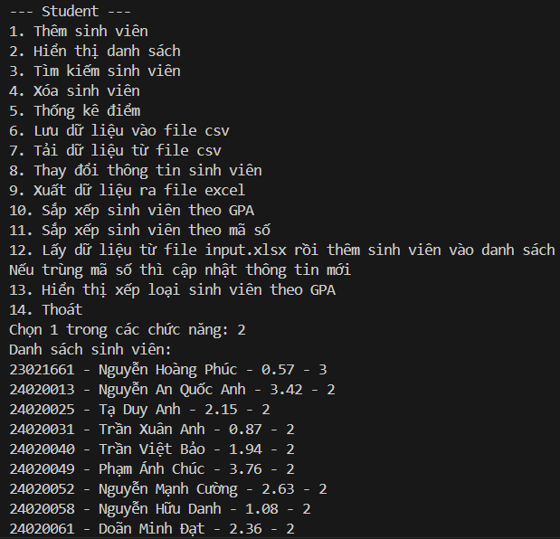]()  
3. Chức năng 3  
[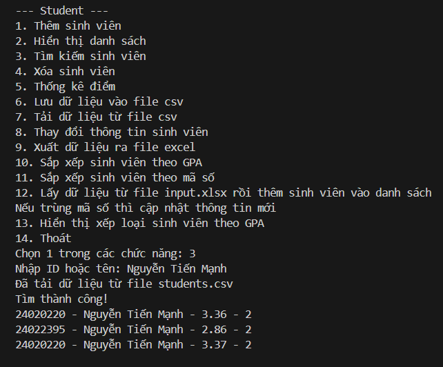]()  
4. Chức năng 4  
  
5. Chức năng 5  
  
6. Chức năng 6  
[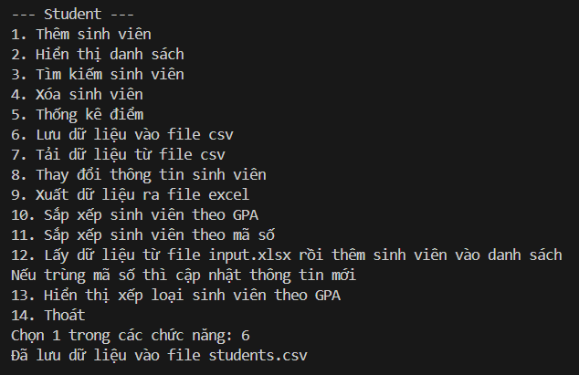]()  
7. Chức năng 7  
[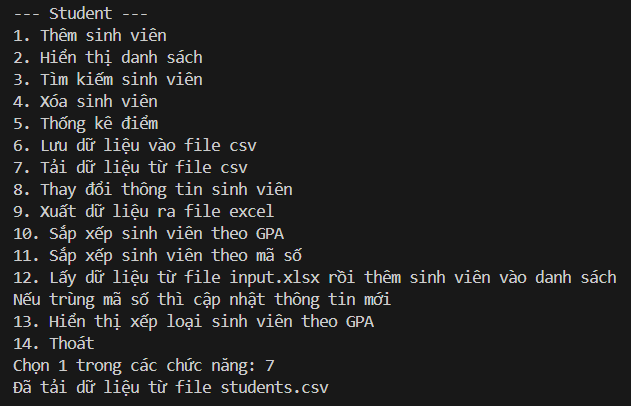]()  
8. Chức năng 8  
  
9. Chức năng 9  
[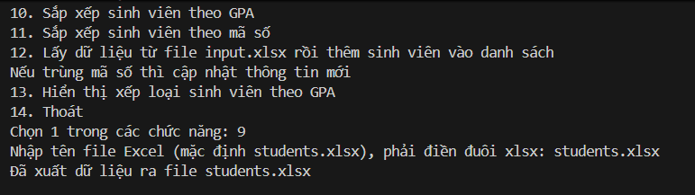]()  
10. Chức năng 10  
[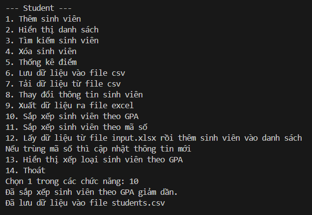]()  
##### Kết quả  
  
11. Chức năng 11  
  
##### Kết quả  
  
12. Chức năng 12  
[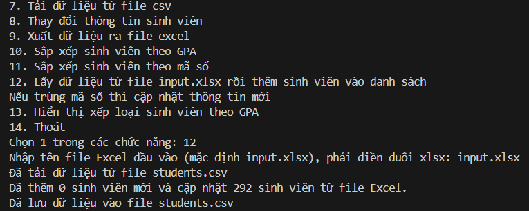]()  
13. Chức năng 13  
 
### TUI
#### App  
[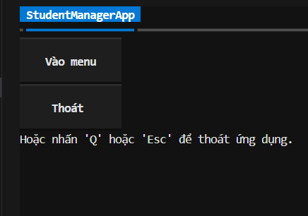]()  
#### Menu  
[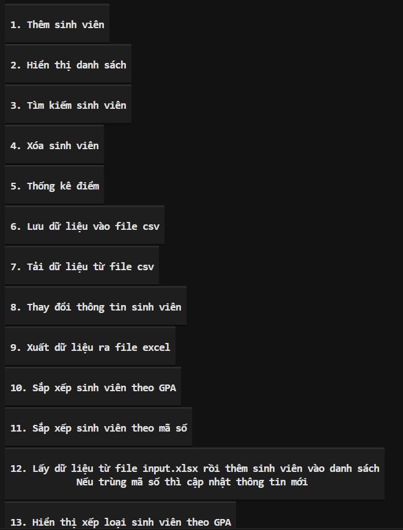]()  
1. Chức năng 1  
[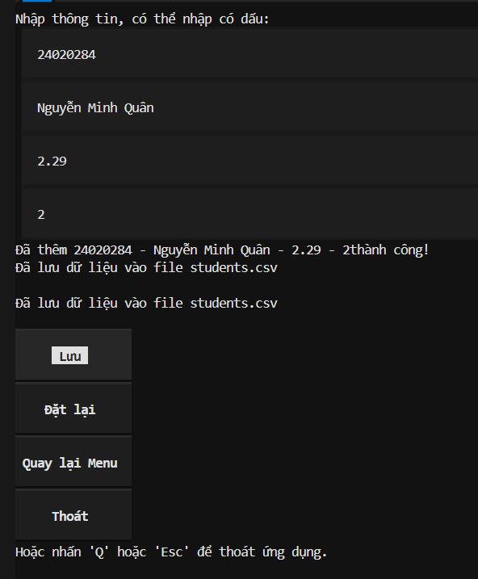]()  
2. Chức năng 2  
[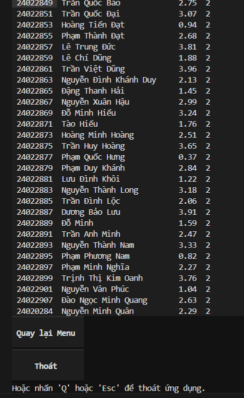]()  
3. Chức năng 3  
[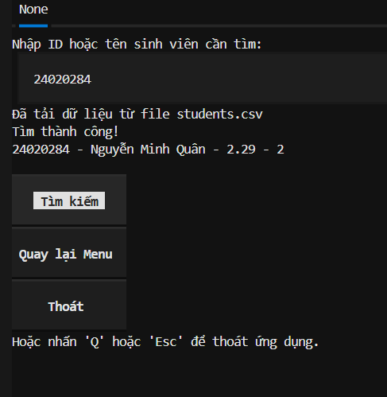]()  
4. Chức năng 4  
[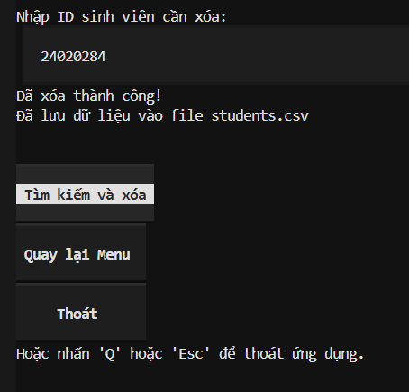]()  
5. Chức năng 5  
[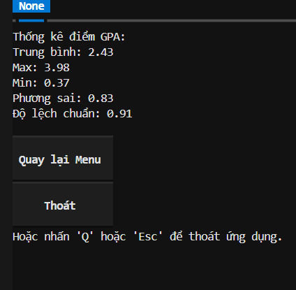]()  
6. Chức năng 6  
[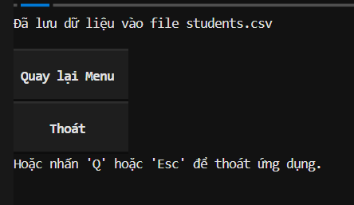]()  
7. Chức năng 7  
[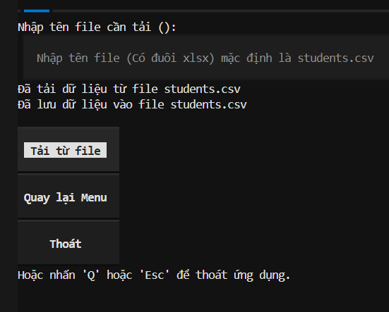]()  
8. Chức năng 8  
[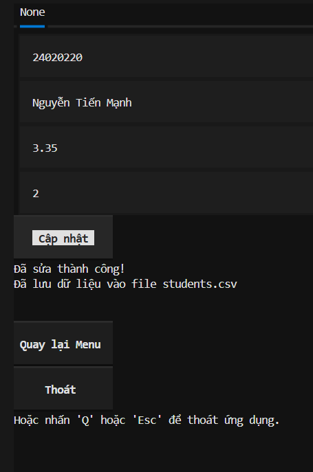]()  
9. Chức năng 9  
[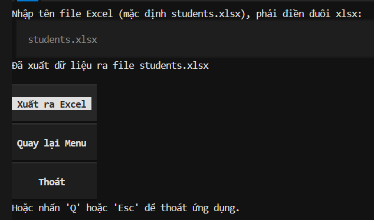]()  
10. Chức năng 10  
[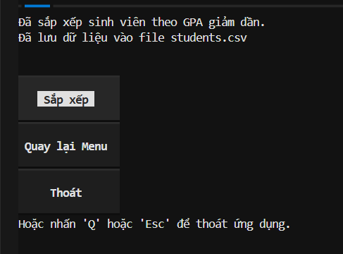]()  
##### Kết quả  
[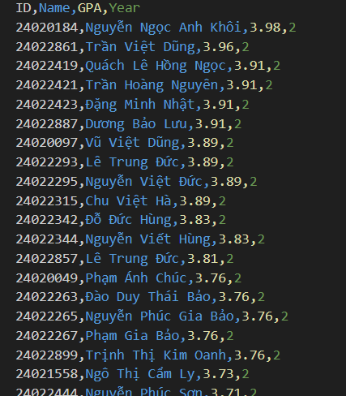]()  
11. Chức năng 11  
[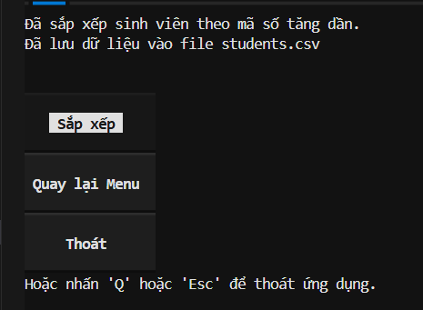]()  
##### Kết quả  
[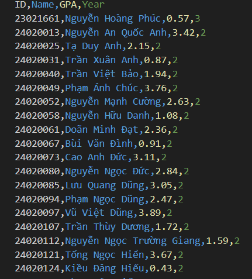]()  
12. Chức năng 12  
[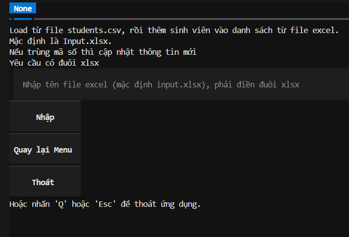]()  
13. Chức năng 13  
[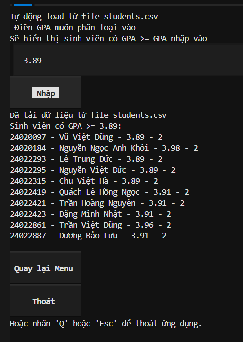]() 