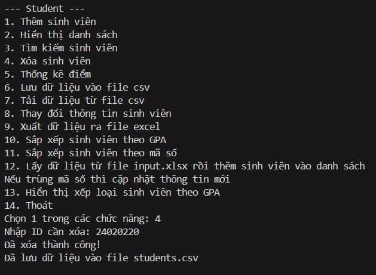
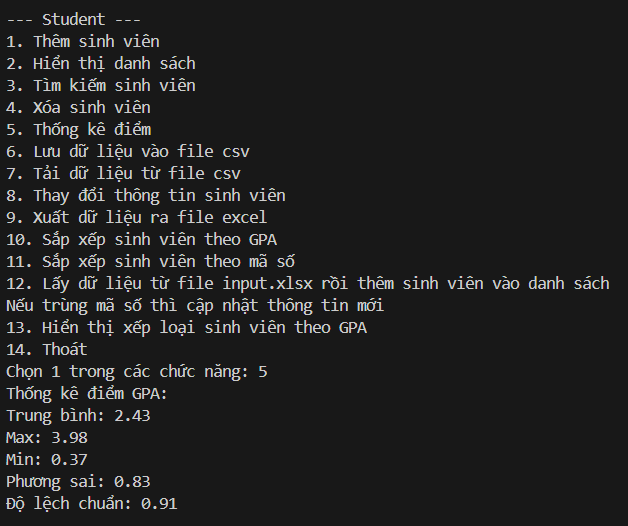
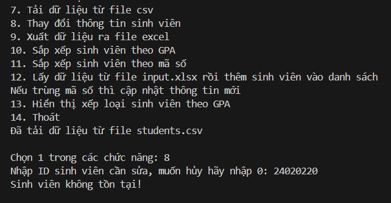
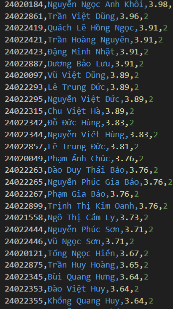
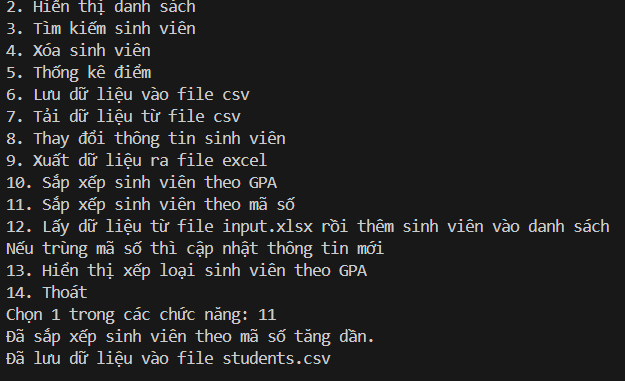
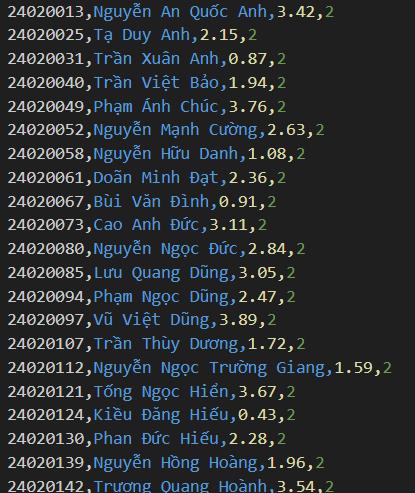
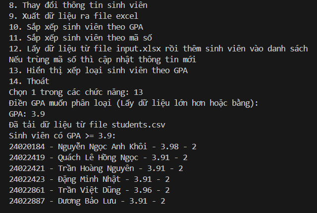

# DỰ ÁN CÁ NHÂN: QUẢN LÝ SINH VIÊN
## THỜI GIAN BẮT ĐẦU DỰ ÁN
- Bắt đầu học và làm khi hết học kì I năm 2
## Mục đích
- Học lập trình python cơ bản
- Mở rộng kiến thức lập trình hướng đối tượng từ java sang python
## Hình thức
Có 2 hình thức, người dùng có thể chọn khi bắt đầu:
1. CLI
2. TUI
## Các chức năng chính
1. Thêm sinh viên
2. Hiển thị danh sách
3. Tìm kiếm sinh viên
4. Xóa sinh viên
5. Thống kê điểm
6. Lưu dữ liệu vào file csv
7. Tải dữ liệu từ file csv
8. Thay đổi thông tin sinh viên
9. Xuất dữ liệu ra file Excel
10. Sắp xếp sinh viên theo GPA
11. Sắp xếp sinh viên theo mã số
12. Lấy dữ liệu từ file input.xlsx rồi thêm sinh viên vào danh sách. Nếu trùng mã số thì cập nhật thông tin mới
13. Hiển thị xếp loại sinh viên theo GPA
14. Thoát
## CÁC CHỨC NĂNG PHỤ
1. Quay lại màn hình menu (TUI)
## Review
### Bắt đầu chạy chương trình

### CLI
1. Chức năng 1

2. Chức năng 2

3. Chức năng 3

4. Chức năng 4

5. Chức năng 5

6. Chức năng 6

7. Chức năng 7

8. Chức năng 8

9. Chức năng 9

10. Chức năng 10

##### Kết quả

11. Chức năng 11

##### Kết quả

12. Chức năng 12

13. Chức năng 13
